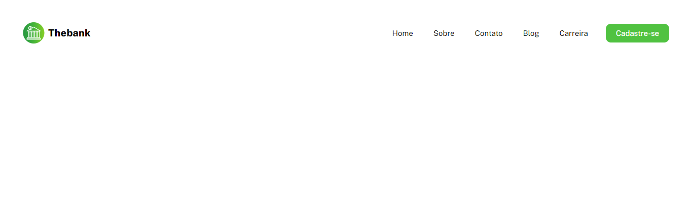

# Exercicio menu com flexbox

Nsse exercício o principal desafio é criar um menu que contenha as informações de uma pagina com lista utilizando o flexbox. Para ser aprimorado as habilidades de posicionamento de elementos usando flexbox.😊👍

[] 

## Tecnologias utilizadas
- HTML
- CSS

